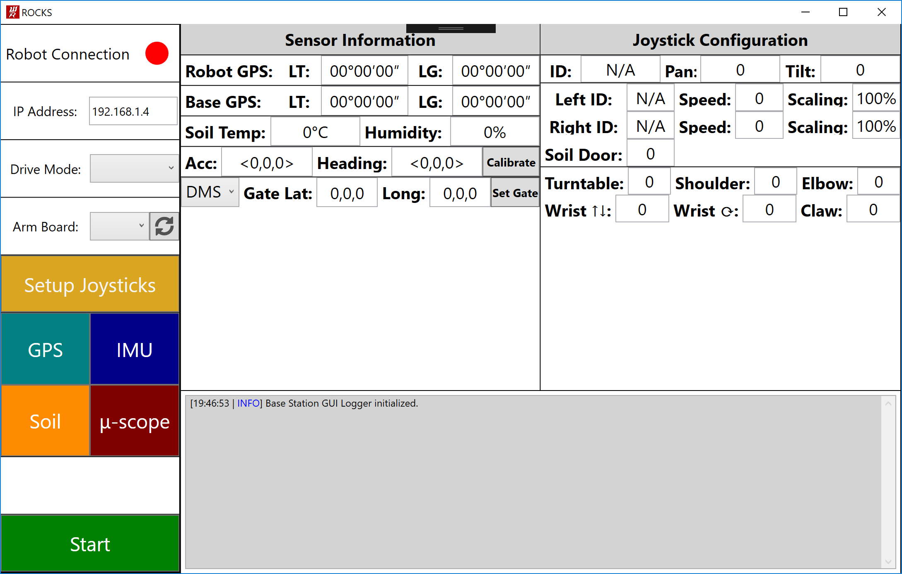

Introduction to WPF
===================

Windows Presentation Foundation (WPF) is a Microsoft Windows specific graphical user interface (GUI) toolkit.
Wisconsin Robotics uses it to build its base station interface, as seen below.

This is intended to be a quick guide into some of the topics encountered while programming with WPF/C#. It does not replace the formal documentation sites, such as [MSDN](https://docs.microsoft.com/en-us/dotnet/framework/wpf/index), nor does it necessarily instill best industry practices.

The following topics are covered here:
* [XAML Basics](01-xaml)
* [Layout Basics](02-layout)
* [Events](03-events)
* [User Controls](04-user-controls)
* [Data Binding](05-data-binding)
* [MVVM/MVC Design Patterns](06-design-patterns)
* [Miscellenous Topics](99-misc)
